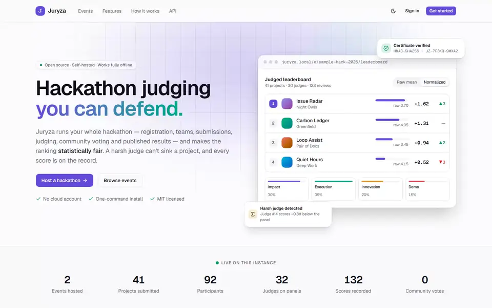
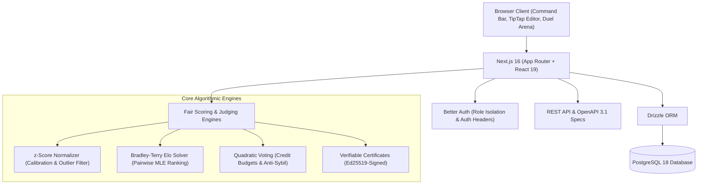
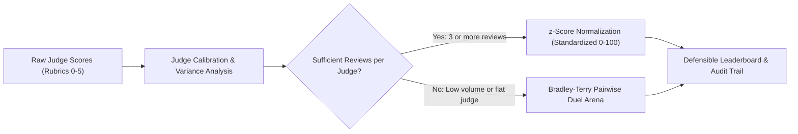
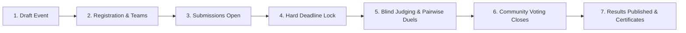

# Juryza

**The self-hosted hackathon platform with judging you can defend.**

Run the whole event — registration, teams, Notion-style project write-ups,
judge panels, weighted scoring, normalization, pairwise ranking, community
voting, leaderboards, certificates — from one `docker compose up`, offline, on
one machine. Every rule is enforced by the API, and every number is explained.

Built for [DOGFOOD 2026](https://dogfoodhack.com). MIT licensed.

[](./LICENSE)
[](./acceptance-report.txt)
[](#run-it)

---

## 🎬 Walkthrough & Demo


*A complete walkthrough demonstrating all roles: Organizer panel & rubric calibration, Judge blind isolated scoring, Pairwise Duel Arena with Bradley–Terry ranking, and Participant Notion-style editor.*

> DOGFOOD also requires a five-minute lifecycle demo video. The walkthrough
> image above is not that deliverable; the only WebM recording currently in the
> workspace is 74 seconds, so the video link is still outstanding.

---

## Run it

```sh
docker compose up
```

Then open **http://localhost:8080** and sign in with one of the demo buttons on
the login page. The boot:

1. starts PostgreSQL 18 and the portal,
2. applies pending database migrations and seeds — the DOGFOOD fixture event
  (41 projects, 30 judges, 126 scores, submissions closed, community voting
  open) **and** a live sandbox event with submissions open,
3. writes `.dogfood.toml` with fresh API tokens,
4. serves the portal on port 8080.

No cloud account, hosted database or external API. Reseed from scratch with
`SEED_RESET=1 docker compose up`; wipe with `docker compose down -v`. Every boot
re-mints the checker tokens in `.dogfood.toml`, so the file is always valid.

### Two datasets: acceptance vs. real-world demo

The seed can draw on two datasets, for two different jobs:

- **`fixtures.json` — the DOGFOOD dataset (always seeded).** The dataset the
  hackathon provided, engineered with awkward cases (a flat judge, a duplicate
  submission, unfinished review batches) to *prove* the judging maths. It is the
  source of truth for acceptance: `run.py` targets its `sample-hack-2026` event
  and the normalization proof is computed from it. It always seeds, unchanged.
- **Hackathon Raptors showcase — real published results (opt-in).** 31 real
  Raptors events rebuilt from the community's own dataset
  ([rank.raptors.dev](https://rank.raptors.dev/data/leaderboard.json)) — real
  projects, teams, placements and prizes — so a judge can see Juryza driving
  authentic, real-world data. It is **off by default** (it would only add noise
  to the acceptance database) and enabled with `SEED_SHOWCASE=1`:

  ```sh
  SEED_SHOWCASE=1 SEED_RESET=1 docker compose up
  ```

  Rule of thumb: `fixtures.json` is for **correctness**, the Raptors data is for
  **demonstration**. Use the plain `docker compose up` for the acceptance run;
  add `SEED_SHOWCASE=1` when you want to browse real events end to end.

> **Upgrading an existing database?** Startup applies tracked migrations. A
> populated pre-migration database is baselined when its required tables are
> present. Back up data before schema changes; `docker compose down -v` deletes
> the database volume and is only for an intentional full reset.

### Demo accounts

| Role | Email | Password | Try |
| --- | --- | --- | --- |
| Organizer | `organizer@juryza.test` | `organizer-password-123` | Organizer console for both events: results, judges, assignments, integrity |
| Judge | `judge.a@juryza.test` | `judge-a-password-123` | Scoring console and pairwise mode |
| Judge | `judge.b@juryza.test` | `judge-b-password-123` | Proves judges can't see each other's scores |
| Participant | `participant@juryza.test` | `participant-password-123` | Team "Night Owls" and its draft project in the editor |
| Admin | `admin@juryza.test` | `admin-password-123` | Users and roles |

Fixture judges sign in with `judge-password-123`, fixture team members with
`member-password-123`.

### Verify it

With the containerized stack running (`docker compose up -d`), run the acceptance checker:

```sh
# Linux / macOS
python3 run.py .dogfood.toml

# Windows (if python3 is not aliased)
python run.py .dogfood.toml
# or
py run.py .dogfood.toml
```

The committed [`acceptance-report.txt`](./acceptance-report.txt) is generated
against the containerized build on port 8080. Juryza claims T1–T4 in
`.dogfood.toml`; the official suite verifies T1 and T2 only, so its report marks
T3/T4 as claimed but not verified. Those tiers' features are implemented, but
the official checker does not exercise them.

## A tour in five minutes

1. **Landing → Events → Open Build 2026.** Overview, rules, tracks, prizes,
   judging criteria with weights, the judging panel and the timeline.
2. **Sign in as the participant.** Dashboard → *Issue Radar* opens in the
   editor: type `/` for blocks, select text for formatting, set the track and
   links in the page properties. It autosaves. Submit it.
3. **Sign in as the organizer → My events → Open Build 2026.** Invite a judge,
   generate assignments (preview first — conflicts of interest and track limits
   are respected), watch progress on the overview dashboard.
4. **Sample Hack 2026 → Results.** Raw vs normalized ranking with rank changes,
   each judge's calibration (the fixture's flat judge is flagged), the pairwise
   ranking. *Submissions* surfaces the duplicate "Dry Harbour" submission.
   Publish (Juryza makes you close voting first), then open the public
   leaderboard and *Compare* any project with its closest rivals.
5. **API.** Settings → API tokens → create one, then try the curl on
   `/docs/api`. Everything you just clicked is an API call.

## What it does

### T1 — core
- Email/password accounts and sessions; five roles (visitor, participant,
  judge, organizer, admin) with **per-event** permissions on top.
- Events with tracks, prizes (overall, per track, community), rich overview and
  rules, dates for every phase, draft/published visibility. Many events per
  install.
- Teams by invite link (resettable), size limits, "looking for members" team
  finder, rosters that lock at the deadline.
- Projects written in a **Notion-style block editor** (slash menu, markdown
  shortcuts, to-dos, code, images, floating toolbar) with Notion-like
  properties, autosave, draft → submit → withdraw until the deadline.
- **Deadline enforced in the backend** for creating, editing, submitting and
  team changes.
- Public gallery with search, track and tech-tag filters.

### T2 — judging
- Judge panels per event: invite by email (bound, single-use links), limit
  judges to tracks.
- Assignment planner — balanced or batch, **conflict-of-interest aware**, track
  aware, idempotent, with a dry-run preview and coverage report.
- **Weighted, organizer-configurable rubric**; re-weighting recomputes
  instantly.
- Scoring console with keyboard shortcuts; **judges cannot read each other's
  scores — enforced in the API** (403, audited).
- Live organizer dashboard: KPIs, submissions per day, projects per track,
  judge progress (who hasn't started), activity feed.
- **Per-judge z-score normalization**, documented and defended with a proof on
  the fixture data ([JUDGING.md](./JUDGING.md)); judge calibration flags.
- CSV (and JSON) export at every stage: participants, teams, projects,
  assignments, scores, results, votes, comments, audit.

### T3 — public
- Community voting with **configurable access** — signed-in, email-verified
  (one-time code, domain allowlist) or open link.
- **Quadratic voting with a per-voter credit budget**, enforced server-side.
- Comments on projects; moderation by organizers.
- **Results hidden** from everyone but the event's organizers until published;
  publishing is refused while voting is open.
- **Ballots randomized per voter**; no self-votes.
- Anti-abuse: rate limits, duplicate detection, per-network caps, integrity
  dashboard, full audit trail.

### T4 — stretch
- **REST API for every UI action** — the UI itself is built on it — with an
  **OpenAPI 3.1** spec at `/api/openapi.json` and a reference at `/docs/api`;
  personal API tokens.
- **Webhooks** (per-subscription HMAC signatures, delivery log, test pings).
- **Certificates** for judges and winners — **signed and publicly verifiable**
  at `/certificates/<serial>`, printable.
- **Embeddable gallery widget** (`<script src="/embed.js">`).
- **Bulk import and export** — a bundle format that is a superset of the
  fixtures file, so exports re-import and the fixtures import directly.

### Beyond the tiers
- **Automatic project comparison**: pick one project and Juryza finds its
  closest rivals (content similarity + neighbours in the ranking) and compares
  them side by side — per-criterion means, normalized scores, votes, pairwise
  head-to-head, content overlap.
- **Duplicate and look-alike detection** (TF-IDF cosine + same-repo/title).
- **Pairwise judging** with Bradley–Terry ranking and active pair selection.
- Leaderboards with podium, prizes, per-track, community and pairwise views.
- Public profiles with skills, projects, judging history and certificates.
- Command palette (⌘K), light/dark themes, responsive layouts.

### Bonus challenges
Normalization proof ([JUDGING.md §4](./JUDGING.md)) · pairwise mode with
Bradley–Terry ([§5](./JUDGING.md)) · threat model ([THREAT-MODEL.md](./THREAT-MODEL.md)) ·
API-first with a published OpenAPI spec.

## System Architecture & Data Flow



### Judging & Normalization Pipeline



### Event Lifecycle & Permissions



---

## 📝 Write-up Challenge & Technical Deep-Dive

An in-depth architectural breakdown written for the hackathon write-up challenge:
- **Article**: *Building Juryza: Hackathon Judging You Can Defend*
- **Deep-Dive Topics**: The math of z-score normalization vs Bradley–Terry pairwise ranking, building an offline-first single-container evaluation engine, and enforcing hard cryptographic/API invariants without cloud lock-in.

---

## Documentation

| File | What |
| --- | --- |
| [ARCHITECTURE.md](./ARCHITECTURE.md) | System shape, trust boundary, decisions |
| [DATA-MODEL.md](./DATA-MODEL.md) | Schema and the import/export paths |
| [JUDGING.md](./JUDGING.md) | Assignment, scoring maths, normalization proof, pairwise, voting |
| [THREAT-MODEL.md](./THREAT-MODEL.md) | Attacks stopped and not stopped |

## Development

```sh
bun install
docker compose up -d db
cd apps/juryza
bun run db:migrate
bun run seed
bun run dev          # http://localhost:3000
```

Quality gates (from the repo root):
- `bun run typecheck` — TypeScript type checking across all workspaces.
- `bun run lint` — Biome code style and linter checks.
- `bun run test` — Runs all 75 offline unit tests (scoring math, Bradley-Terry ranking, pairing algorithms, similarity detection, CSV sanitization, quadratic voting, and rich-text parsing).
- `JURYZA_TEST_URL=http://localhost:8080 bun run --cwd apps/juryza test` — Runs the full 88-test suite, including the 13 live HTTP API integrity and role-isolation tests against the running instance.
- `bun run build` — Production bundle build.

## Stack

Next.js 16 (App Router, React 19, React Compiler) · PostgreSQL 18 + Drizzle ·
Better Auth · TanStack Query · Tiptap 3 · Tailwind v4 + shadcn/ui on Base UI ·
Bun + Turborepo. Reasons in [ARCHITECTURE.md](./ARCHITECTURE.md).

## Honest limits

- Community voting is raised-cost, not Sybil-proof, in open or account mode;
  use email-verified voting with a domain allowlist when it matters.
- Rate limits live in process memory: fine for one container, not for several.
- No outbound email (the build runs offline): verification codes and password
  reset links are written to the server log.
- An event's organizers are trusted: their actions are audited, not prevented.
- Normalization assumes each judge saw a representative slice of projects; with
  very few reviews per judge, prefer pairwise mode (see JUDGING.md).

## License

[MIT](./LICENSE).
